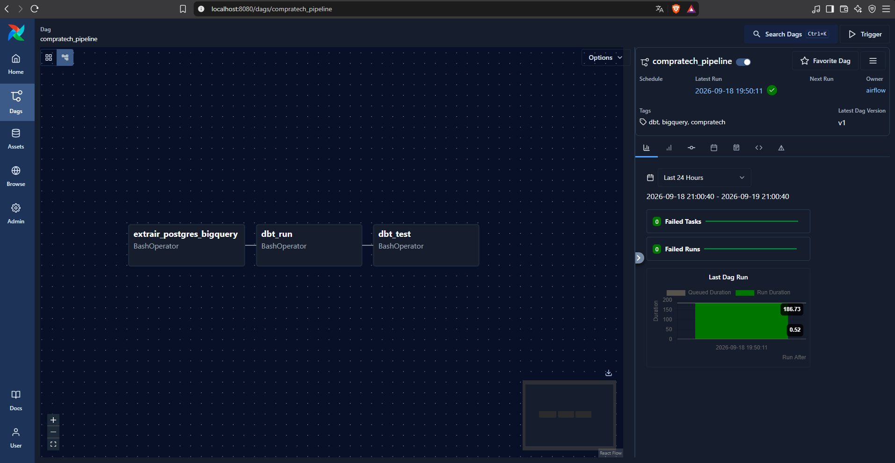
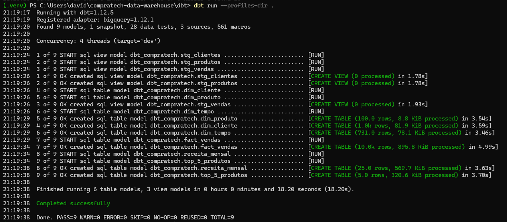
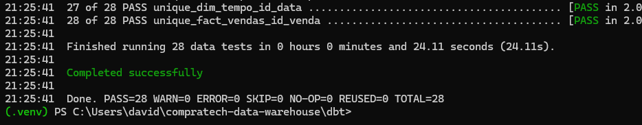
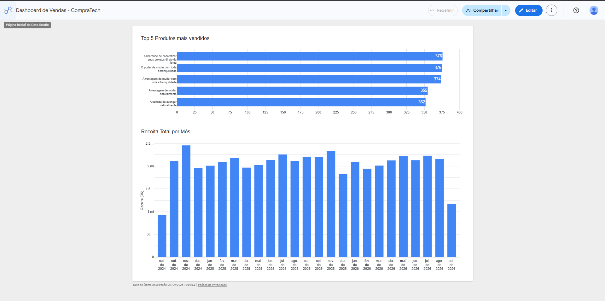

# CompraTech Data Warehouse

Projeto de Engenharia de Dados desenvolvido para simular a construção de um Data Warehouse para uma empresa fictícia de e-commerce chamada **CompraTech**.

O objetivo do projeto é centralizar dados de clientes, produtos e vendas provenientes de um banco PostgreSQL, realizar a ingestão dos dados no Google BigQuery, aplicar transformações utilizando dbt e automatizar o pipeline com Apache Airflow.

## Arquitetura do Projeto

O fluxo de dados implementado é:

PostgreSQL → Python/Pandas → BigQuery (Raw) → dbt → Data Warehouse → Looker Studio

A execução do pipeline é orquestrada pelo Apache Airflow utilizando Docker.

## Tecnologias utilizadas

- Python
- Pandas
- PostgreSQL
- Google BigQuery
- dbt Core
- Apache Airflow
- Docker / Docker Compose
- Looker Studio
- Git / GitHub 

## Dados

Para simular o ambiente transacional da CompraTech, foram gerados dados fictícios utilizando Python e Faker.

A base utilizada no projeto contém:

- 1.000 clientes
- 100 produtos
- 10.000 vendas

Os dados são armazenados inicialmente no PostgreSQL e posteriormente carregados para o dataset `raw_data` no BigQuery.

## Modelagem Dimensional

O Data Warehouse utiliza um modelo estrela (Star Schema), composto pelas seguintes dimensões e tabela fato:

### Dimensões

- `dim_cliente` — informações dos clientes
- `dim_produto` — informações dos produtos
- `dim_tempo` — calendário utilizado para análises temporais

### Tabela Fato

- `fact_vendas` — armazena as transações de vendas e métricas como quantidade, valor unitário, valor total e desconto

A tabela fato possui relacionamento com as dimensões de cliente, produto e tempo por meio de chaves substitutas (surrogate keys).

## Transformações com dbt

O dbt Core é utilizado para transformar os dados da camada `raw_data` em modelos analíticos organizados em duas camadas:

### Staging

- `stg_clientes`
- `stg_produtos`
- `stg_vendas`

### Marts

- `dim_cliente`
- `dim_produto`
- `dim_tempo`
- `fact_vendas`

Também foram criados modelos analíticos utilizados pelo dashboard:

- `receita_mensal`
- `top_5_produtos`

## Qualidade dos Dados

Foram implementados testes automatizados com dbt para validar a integridade do Data Warehouse, incluindo:

- `unique`
- `not_null`
- `relationships`
- `accepted_values`

A execução final dos testes apresentou:

**28 testes aprovados, 0 warnings e 0 erros.**

## SCD Type 2

Para manter o histórico de alterações dos clientes, foi implementada uma estratégia de Slowly Changing Dimension Type 2 (SCD Type 2).

A implementação utiliza campos de controle para identificar o período de validade de cada versão do registro:

- `valid_from` — início da validade do registro
- `valid_to` — fim da validade do registro
- `is_current` — indica se a versão é a atual

O processo foi implementado utilizando dbt Snapshot. A primeira execução do snapshot no BigQuery foi concluída com sucesso.

Durante a atualização de um registro, a segunda execução encontrou uma limitação do BigQuery Sandbox, que não permite as operações DML necessárias para atualizar o histórico sem faturamento habilitado.

Para demonstrar o funcionamento completo do SCD Type 2 sem gerar custos, foi criada uma implementação adicional em PostgreSQL, armazenada em:

`scd2_demo/scd2_cliente.sql`

Nessa demonstração, uma alteração de estado de um cliente gera duas versões do mesmo registro: a versão anterior é encerrada e uma nova versão passa a ser identificada como atual.

## Orquestração com Apache Airflow

O pipeline de dados é orquestrado pelo Apache Airflow, executado em ambiente Docker.

A DAG `compratech_pipeline` automatiza as seguintes etapas:

1. Extração dos dados do PostgreSQL e carregamento no BigQuery.
2. Execução das transformações com `dbt run`.
3. Execução dos testes de qualidade com `dbt test`.

Fluxo da DAG:

`PostgreSQL → BigQuery → dbt run → dbt test`

A execução end-to-end da DAG foi concluída com sucesso, incluindo as três tarefas do pipeline.

## Dashboard no Looker Studio

Para visualização dos dados foi desenvolvido um dashboard no Looker Studio conectado ao Data Warehouse no BigQuery.

O dashboard apresenta dois indicadores principais:

- **Receita Total por Mês** — acompanhamento da evolução mensal da receita.
- **Top 5 Produtos mais Vendidos** — ranking dos produtos com maior quantidade vendida.

Para alimentar as visualizações foram criados os modelos analíticos `receita_mensal` e `top_5_produtos` utilizando dbt.

## Business Key e Surrogate Key

No Data Warehouse são utilizados dois conceitos importantes de identificação dos registros:

- **Business Key:** chave proveniente do sistema de origem e utilizada para identificar uma entidade no contexto do negócio. Exemplos neste projeto incluem `id_cliente`, `cpf` e `sku`.

- **Surrogate Key:** chave criada dentro do Data Warehouse para identificar de forma única cada registro de uma dimensão, independentemente da chave utilizada no sistema de origem.

A utilização de surrogate keys facilita o relacionamento entre fatos e dimensões e permite manter diferentes versões de uma mesma entidade ao utilizar técnicas como SCD Type 2.

## Como executar o projeto

### Pré-requisitos

Para executar o projeto localmente é necessário ter instalado:

- Git
- Docker Desktop
- Docker Compose
- Python 3.12 ou superior
- Google Cloud CLI

### Configuração das variáveis de ambiente

Crie o arquivo `.env` a partir do exemplo disponível no projeto:

```env
POSTGRES_HOST=localhost
POSTGRES_PORT=5432
POSTGRES_DB=compratech
POSTGRES_USER=compratech
POSTGRES_PASSWORD=sua_senha_aqui

GCP_PROJECT_ID=seu_project_id
BQ_DATASET_ID=raw_data
```

O arquivo `.env` contém configurações locais e credenciais e, por segurança, não é versionado no Git.

### Executando os serviços com Docker

Com o arquivo `.env` configurado, execute os containers do PostgreSQL e Apache Airflow:

```bash
docker compose up -d
```

Para verificar se os containers estão em execução:

```bash
docker compose ps
```

A interface do Apache Airflow ficará disponível localmente na porta `8080`.

### Executando as transformações com dbt

Para executar manualmente as transformações do Data Warehouse:

```bash
cd dbt
dbt run --profiles-dir .
```

Para executar os testes de qualidade dos dados:

```bash
dbt test --profiles-dir .
```

O pipeline também executa automaticamente essas etapas por meio da DAG `compratech_pipeline` no Apache Airflow.

## Estrutura do Projeto

```text
compratech-data-warehouse/
├── airflow/
│   ├── dags/
│   ├── plugins/
│   └── Dockerfile
├── data_generator/
│   ├── generate_data.py
│   └── load_to_bigquery.py
├── dbt/
│   ├── models/
│   └── snapshots/
├── postgres/
├── scd2_demo/
│   └── scd2_cliente.sql
├── .env.example
├── .gitignore
├── docker-compose.yml
└── README.md
```

Cada diretório representa uma etapa da arquitetura, separando geração e ingestão de dados, transformação com dbt, orquestração com Airflow e demonstração do SCD Type 2.

## Evidências do Projeto

### Pipeline automatizado com Apache Airflow

A DAG `compratech_pipeline` automatiza o fluxo de ingestão e transformação dos dados:

`PostgreSQL → BigQuery → dbt run → dbt test`



### Transformações com dbt

As transformações do Data Warehouse são executadas com dbt, criando as camadas de staging, dimensões, tabela fato e modelos analíticos no BigQuery.

O comando `dbt run` executou com sucesso os 9 modelos do projeto:



### Testes de qualidade com dbt

Foram implementados testes de qualidade e integridade dos dados utilizando dbt. Ao todo, 28 testes foram executados com sucesso, sem erros ou warnings.



### Dashboard de Vendas

Dashboard desenvolvido no Looker Studio utilizando os dados transformados no BigQuery.

 